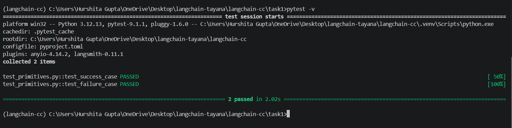

# Task 1 — Primitive Inventory

## Deliverable 1 — Primitive Inventory

The implementation is available in `primitives.py`.

The file instantiates the four required LangChain primitives:

* **Chat Model** — `ChatOpenRouter`
* **Prompt Template** — `ChatPromptTemplate`
* **Output Parser** — `StrOutputParser`
* **Retriever** — `InMemoryVectorStore` converted to a retriever

For each primitive, the input and output schemas are printed using LangChain's runnable schema methods.

Run using:

```bash
python task1/primitives.py
```

---

## Deliverable 2 — Terminal Output

The program successfully prints the input and output schemas for:

* Chat Model
* Prompt Template
* Output Parser
* Retriever

This demonstrates the expected input/output contract of each LangChain primitive.

**Evidence:**

> The ouput is saved in output.txt.

---

## Deliverable 3 — Automated Tests

Automated tests are implemented in `test_primitives.py`.

The tests cover:

* **Success case** — verifies that valid input is successfully accepted and processed by the LangChain primitives.
* **Failure case** — verifies that a prompt invocation with the required `question` variable missing raises an exception.

Run the tests using:

```bash
pytest task1/test_primitives.py -v
```

**Test Result:**


