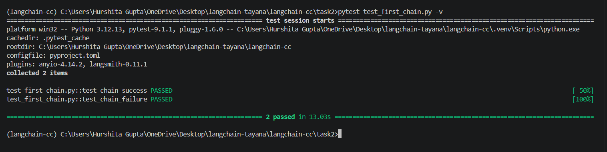

# Task 2 — First Chain

## Deliverable 4 — First Chain Implementation

The implementation is available in `first_chain.py`.

The file creates an LCEL chain using:

```python
prompt | model | parser
```

The chain uses:

* `ChatPromptTemplate`
* `ChatOpenRouter`
* `StrOutputParser`

It is executed on five different questions using `chain.invoke()`.

Run using:

```bash
python task2/first_chain.py
```

---

## Deliverable 5 — Terminal Output

The chain was successfully executed on five inputs and returned a response for each question.

The output was saved using:

```bash
python task2/first_chain.py > task2/output.txt
```

The saved `output.txt` file contains all five question-answer pairs produced by the LCEL chain.

---

## Deliverable 6 — Automated Tests

Automated tests are implemented in `test_first_chain.py`.

The tests cover:

* **Success case** — a valid `question` is passed through the complete `prompt | model | parser` chain and a non-empty string response is returned.
* **Failure case** — the required `question` input is omitted and the chain raises an exception.

Run the tests using:

```bash
pytest task2/test_first_chain.py -v
```

Expected result:


