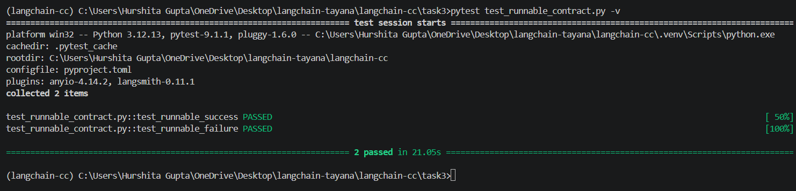

# Task 3 — Runnable Contract

## Deliverable 7 — Runnable Contract Implementation

The implementation is available in `runnable_contract.py`.

The starter LCEL chain:

```python
prompt | model | StrOutputParser()
```

was extended to demonstrate the four Runnable execution methods:

* `invoke()` — executes the chain for one input.
* `batch()` — executes the chain for multiple inputs.
* `stream()` — processes the model response as streamed chunks.
* `ainvoke()` — executes the chain asynchronously.

Latency for every execution method is measured using `time.perf_counter()` and included in a structured JSON trace.

Run using:

```bash
python task3/runnable_contract.py
```

---

## Deliverable 8 — Runnable Output and Latency

The program successfully executes the same LCEL chain using `invoke`, `batch`, `stream`, and `ainvoke`.

Each execution produces a structured JSON trace containing the execution method, input/output and latency in milliseconds.

The evidence was saved using:

```bash
python task3/runnable_contract.py > task3/output.txt
```

The resulting `output.txt` contains the recorded outputs and latency measurements for all four Runnable methods.

---

## Deliverable 9 — Automated Tests

Automated tests are implemented in `test_runnable_contract.py`.

The tests include:

* **Success case** — invokes the Runnable with a valid question and verifies that a non-empty string response and latency measurement are returned.
* **Failure case** — invokes the chain without the required `question` field and verifies that an exception is raised.

Run using:

```bash
pytest task3/test_runnable_contract.py -v
```

