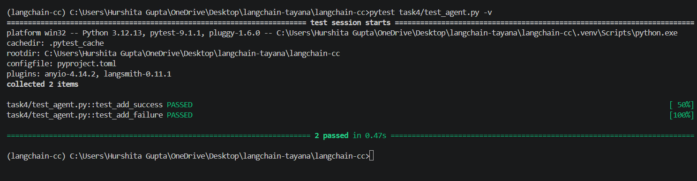

# Task 4 — Tool + Agent

## Deliverable 10 — Tool + Agent Implementation

The implementation is available in `agent.py`.

A simple `add` tool is created using LangChain's `@tool` decorator and registered with the model using `bind_tools()`.

The model receives an arithmetic question, decides to call the tool, and the program executes the requested tool call.

Run using:

```bash
python task4/tool_agent.py
```

## Deliverable 11 — Tool Call Evidence

The model successfully calls the `add` tool.

The program logs the tool name, arguments, and result.

Example:

```text
{"tool": "add", "arguments": {"a": 15, "b": 27}}
{"result": 42}
Final answer: 42
```

The complete execution output is saved in `output.txt`.

## Deliverable 12 — Automated Tests

Automated tests are implemented in `test_tool_agent.py`.

The tests include:

* **Success case** — valid numbers are passed to the `add` tool and the expected result is returned.
* **Failure case** — invalid input is passed to the tool and an exception is expected.

Run using:

```bash
pytest task4/test_tool_agent.py -v
```

