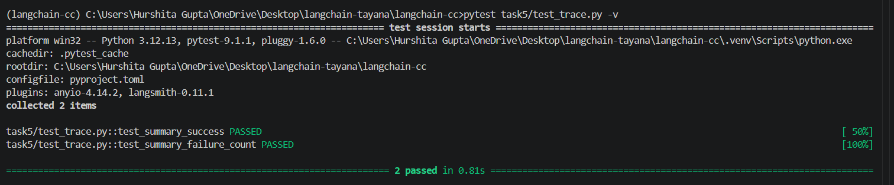

# Task 5 — Trace Report

## Deliverable 13 — Trace Report Implementation

The implementation is available in `trace_report.py`.

Each model run emits a structured JSON trace containing:

* Question
* Model output
* Input tokens
* Output tokens
* Total tokens
* Latency in milliseconds
* Success status
* Error information

After all runs, the program generates a summary containing the number of runs, successful runs, failures, total tokens and average latency.

Run using:

```bash
python task5/trace_report.py
```

## Deliverable 14 — Trace Output

Structured JSON traces are produced for every model call.

A final summary reports total runs, successful runs, failures, total tokens and average latency.

The execution evidence is saved using:

```bash
python task5/trace_report.py > task5/output.txt
```

## Deliverable 15 — Automated Tests

Automated tests are implemented in `test_trace_report.py`.

The tests cover:

* **Success case** — verifies that trace statistics and token totals are summarised correctly.
* **Failure case** — verifies that failed runs are correctly counted in the summary.

Run using:

```bash
pytest task5/test_trace_report.py -v
```

